# 🏠 SmartHome IoT SW Control Remoto de las casas
### Control de todas las vivienda mediante APP WEB.


Para que nuestro dispositivo o laboratorio sea realmente IOT, necesitamos poder interactuar con nuestra casa mediante cualquier equipo conectado con Internet.

Esta aplicación web consigue controlar todas las casas desde un único centro de control.

---

## 📌 Descripción

Este SW es una aplicación WEB en python/flusk para poder monitorizar/controlar todas las casas al mismo tiempo desde un dispositivo conectado a Internet.

Básicamente consulta los datos de las casas desde una BBDD en AWS DynamoDB y permite mandar mensajes a cada una de lasa casas para controlar sus dispositivos o cambiar su comportamiento mediante el envio de mensajes MQTT a AWS IOTCore.

Este SW debe de desplegarse en una máquina virtual con acceso a DynamoDB. En nuestro caso que utilizamos el Laboratorio AWS gratuito que ofrece los cursos de AWS LSM, lo implantaremos en la instancia EC2 dentro del mismo laboratorio donde tengamos el AWS DiynamoBD.

---

## 📁 Estructura del proyecto

```
📦 master
 ┣ 📂 templates (Templates HTML de UI)
 ┃ ┗ 📜 index.html (Landing Page)
 ┣ 📂 cert (Carpeta donde dejaremos los certificados de conexión a AWS IOTCore)
 ┗ 📜 app.py (Endpoints REST API)
 ┗ 📜 README.md
```
---

## ⚙️ Pasos previos (Configuración AWS y Raspberry)

Este conjunto de pasos nos sirven para poder conectar cada una de las casas que queremos monitorizar con el entorno CLOUD AWS donde podremos recuperar todos los datos e interactuar con todas las casas conectadas.

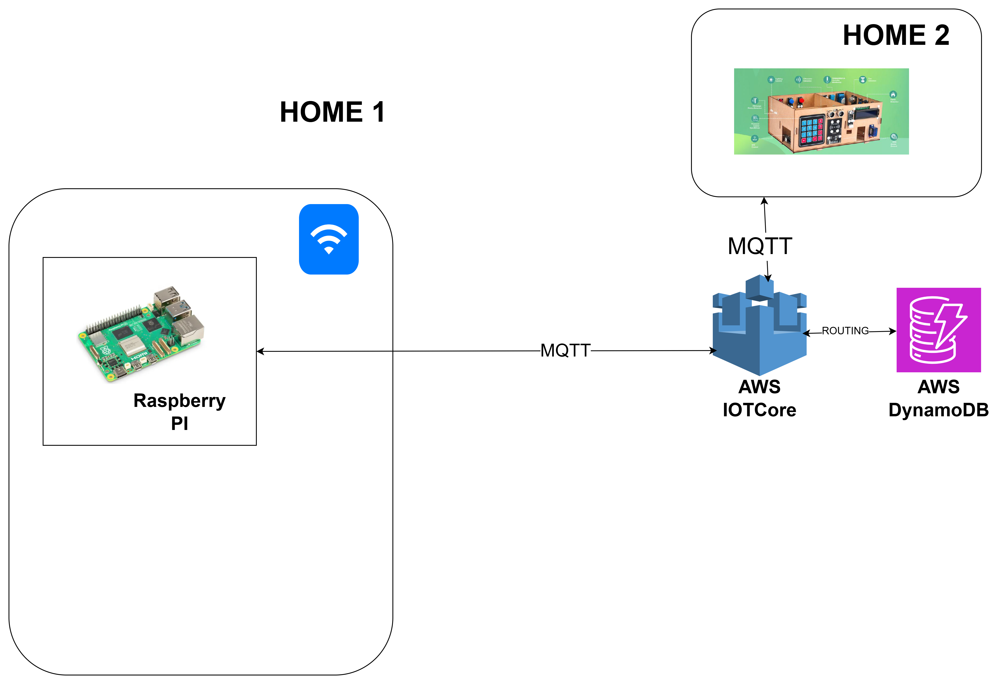

Viendo este dibujo podemos describir lo siguiente:

- Vamos a contratar un servicio PaaS de AWS para poder dar visibilidad exterior a nuestra casa IOT. Este servicio se llama IOTCore, cuyo objetivo es gestionar elementos IOT llamados Things, dandoles un canal de comunicación, securizando la conexión, agrupándolos y enrutando los mensajes recibidos. Sólo tendremos un único servicio IOTCore para todas las casas.
- La comunicación entre las casas y la instancia IOTCore se realiza mediante el protocolo MQTT y da opción de enviar mensajes en ambas direcciones.
    - Mensajes Casa -> IOTCore (Telemetría): Es información util del estado actual de la casa, por ejemplo su temperatura, humedad, estado de la puerta, estado de la iluminación, lo que se nos ocurra.
    - Mensajes IOTCore -> Casa (Comandos): Se les puede mandar a cada casa o a todas comandos de forma remota, por ejemplo para encender las luces.
- Esa comunicación es segura mediante una encriptación con certificado publico-privado. Pudiendo ser un certificado para todos o un certificado hasta para cada THING.
- Los mensajes de telemetría se pueden enrutar y catalogar. O sea puedes decir que los mensajes que vengan persistan directamente en otro servicio PaaS como DynamoDB (BBDD documental) o un S3, o otras sistemas de mensajería.

Por lo tanto vamos a realizar una serie de pasos para poder realizar una prueba de concepto donde veremos mensajes de telemetría desde la casa y enviaremos mensajes de tipo comando a la casa en si.

1. Damos por supuesto que tenemos un Laboratorio AWS gratuito. Accedemos al servicio IOTCore. Debemos dar de alta el THING en IOTCore. Para ello hay que ir al apartado

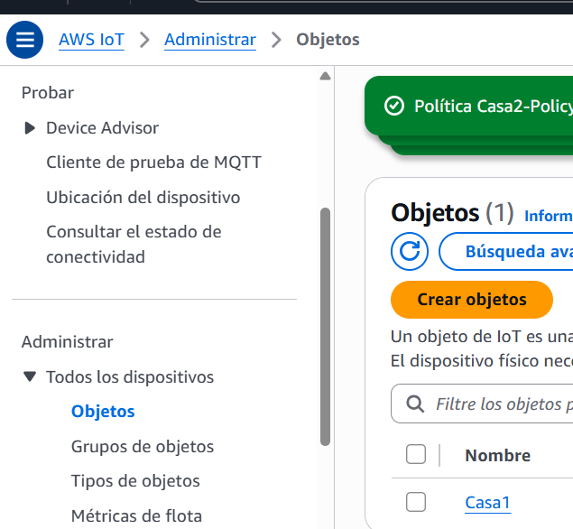

2. Esto crea la información necesaria para conectar ese dispositivo, hasta los certificados que vamos a utilizar para conectar nuestra casa (Thing). Por lo tanto deberemos configurar el SW de la Raspberry PI de la casa correspondiente mediante su WEB en los siguientes apartados: 

    - AWS Endpoint: Poniendo el nombre del Endpoint de IOTCore.
    - Certificate File: Es el nombre y ruta del fichero de certificado para realizar la conexión MQTT entre el Thing y IOTCore. No olvidarse de dejar los ficheros de certificados mediante SCP en la RaspberryPI.
    - Private Key File: Es el nombre y ruta del fichero de clave privada para encriptar las comunicaciones MQTT entre el Thing y IOTCore. No olvidarse de dejar los ficheros de certificados mediante SCP en la RaspberryPI. 
    - Client ID: Aquí pondremos el nombre de la casa a nivel MQTT, se puede poner por ejemplo Casa1, Casa2, etc...
    - Device Name: Aquí pondremos el nombre de la casa a nivel de nuestra plataforma. Si mandamos mensajes a esta casa o recibimos de esta casa, vendrán con este nombre. TODO (Unificar ambos nombres, Client ID y Device Name)
    - Command Topic y Telemetry Topic: Dejar los que hay por defecto. TODO (Dejarlos Hardcoded, ya que es más coherente)

3. Para poder persistir los mensajes que envía la casa en DynamoDB hay que crear un enrutador de mensajes. El enrutador es un mecanismo que nos propone IOTCore para poder filtrar los mensajes de entrada y redirigirlos a algún otro servicio PaaS de AWS.

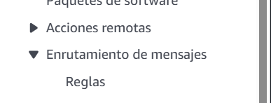

4. Configuramos el enrutador indicando que todos los mensajes que vienen del topic telemetry vayan a una tabla de DynamoDB que se llama también Telemetry.

    1. Se indica el nombre de la regla, su descripción.
    1. La query que nos sirve de filtrado, en nuestro caso SELECT * FROM 'telemetry', que indica que cualquier mensaje que viene del topic de telemetry.
    1. El destino de los mensajes. En nuestro caso será una tabla de DynamoDB. Aquí es importante el concepto de Partition. Una partition es un agrupador de mensajes para que se puedan buscar. Establecemos 2 niveles de partition, la casa de la que proviene el mensaje "house" en el JSON y el timestamp de cuando se ha creado el mensaje "timestamp". El timesatmp es el Epoch time del mensaje en ms.

5. Después de tener configurado tanto los THING (Casas) como el IOTCore y DynamoDB, comprobamos que empiezan a llegar los mensajes de telemetría a DynamoDB. Para eso consultamos en el producto DynamoDB

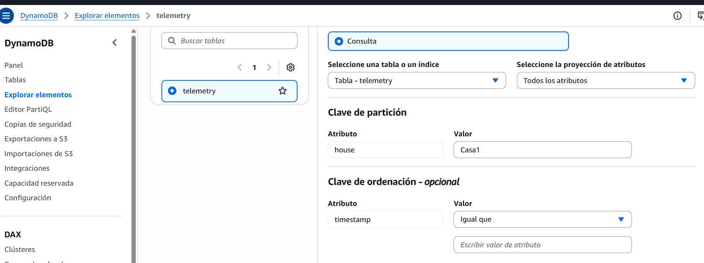
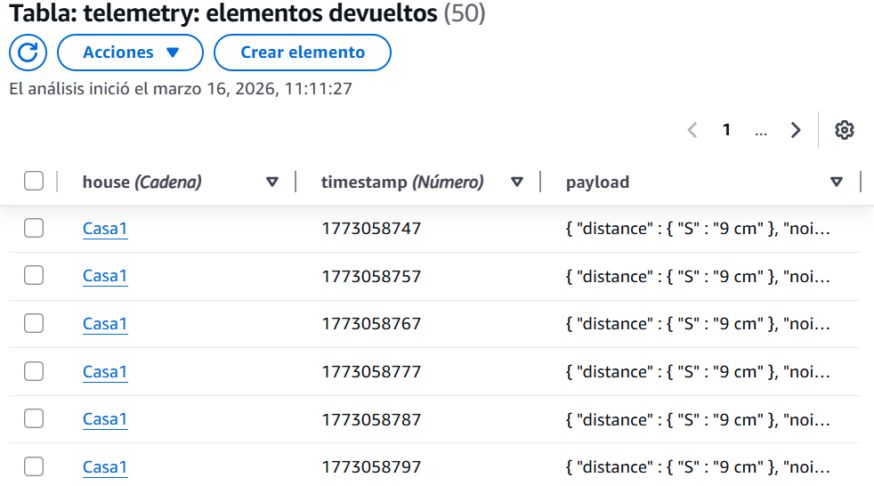
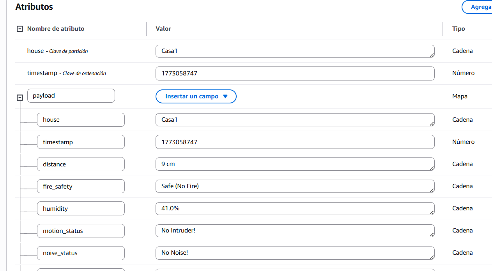

6. Vamos a lanzar ahora comandos a las casa. Para ello hay un cliente MQTT de prueba en IOTCore que nos ayuda.

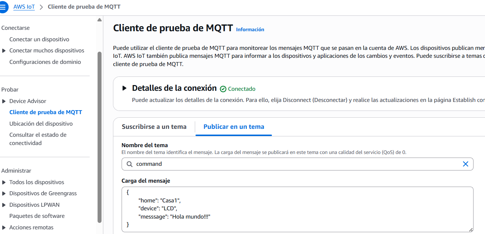

Desde este elemento vamos a poder lanzar comandos al topic de "command". Con un mensaje:
  ```
{
    "home": "Casa1",
    "device": "LCD",
    "message": "Hola mundo!!!"
}
  ```

El SW Master está preparado para recibir este tipo de mensajes de ejemplo y actuar en consecuencia.

---

## 🔌 Arquitectura del sistema

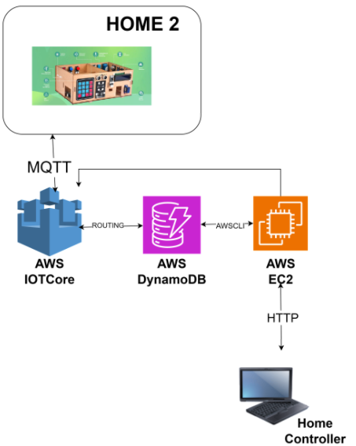

Para que sea un entorno completo de monitorización/control IOT de la casa lo único que nos falta es una aplicación WEB que podamos acceder desde cualquier dispoitivo conectado a Internet.

Esta aplicación WEB se tiene que desplegar en un EC2 dentro de nuestra infraestructura AWS para poder tener acceso a DynamoDB y IOTCore.

---

## 🚀 Instalación de SW en EC2


### 1. Creación instancia EC2 y conexión a ella

Tenemos que crear una instancia EC2, la haremos que sea Amazon Linux como S.O, que ya estamos familiarizados con la Raspberry PI. 
Esa instancia debe tener abierto el puerto 5001, donde desplegaremos nuestra app web. Acordarse entonces de abrir puertos en el Security-Group y de crear la instancia con un certificado .pem para poder hacer conexiones SSH y SCP.
Podemos conectarnos mediante SSH a esa instancia EC2, utilzando su IP Pública.

  ```
ssh -i "ruta_fichero_pem" ec2-user@ippublica
POR EJEMPLO
ssh -i "Control.pem" ec2-user@175.12.16.165
  ```

### 2. Alta del THING Control

Debemos dar de alta el THING en IOTCore. Para ello debemos hacerlo de la misma manera que hemos hecho con cada una de las casas a controlar. El centro de control es como otro THING, pero que se puede comunicar con todos los demás.

Los certificados hay que dejarlos en la carpeta cert, reemplazando los existentes.

### 3. Envio de ficheros SW a EC2

Pasaremos ese código fuente mediante SCP. Directamente toda la carpeta cloud.

  ```
scp -i "ruta_fichero_pem" -r fichero_enviar ec2-user@ippublica:ruta_destino
POR EJEMPLO
scp -i "Control.pem" -r . ec2-user@175.12.16.165:/home/ec2-user/cloud
  ```

### 4. Instalación de librerias necesarias

Hace falta bajarse mirar si está instalado python.

  ```
python3 --version
  ```
Si está la 3.9.X entonces OK
Si no está entonces

  ```
sudo yum install python3 -y # para instalar python
sudo yum install python3-pip -y # para instalar pip, gestor de paquetes de python
  ```

Hace falta bajarse con pip las librerias necesarias

  ```
pip install awsiotsdk # para la conexión con AWS
pip install Flask # para crear un servicio API REST
  ```
### 5. Ejecución del SW

- Nos movemos a /home/ec2-user/cloud
- Ejecutamos python3 app.py

### 6. Comprobación de funcionamiento

Al haber cargado el programa desde nuestro PC podremos acceder mediante nuestro navegador web favorito a  http://ip_ec2:5001

Tiene un COMBO para poder elegir la Casa a controlar:

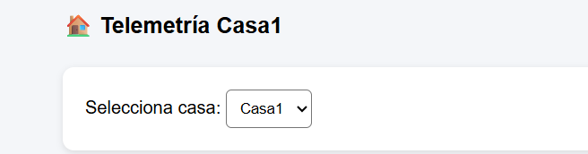

De cada casa se puede graficar la telemetría de la casa, el codígo internamente explota un JSON con la información del último día de las casas que se recoje de DynamoDB:

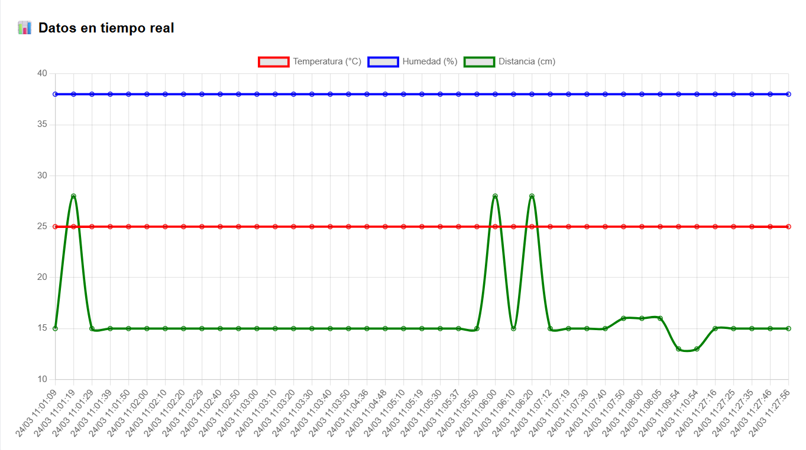

Se puede refrescar esa información con un botón. Ese botón recarga de DynamoDB el JSON a graficar.

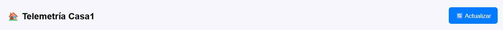

También tenemos un apartado para mandar una operación a la casa, igual que hicimos con la UI WEB de IOTCore.

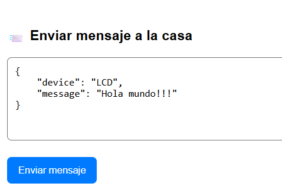

---

## 🧠 Funcionalidades

✔ Monitorización de todas las casas del sistema
✔ Acciones simples sobre cada casa (Solo LCD)

---

## 👨‍💻 Recomendación

💡 Se recomienda revisar el código fuente para entender completamente el funcionamiento del sistema y poder ampliarlo.

---

## 🙌 Autor

Miguel Goyena
