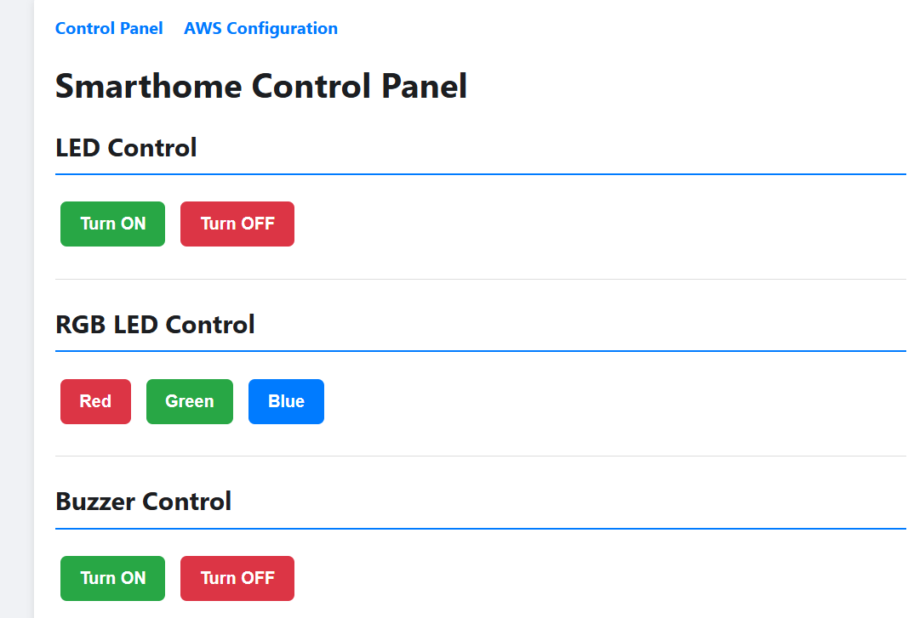
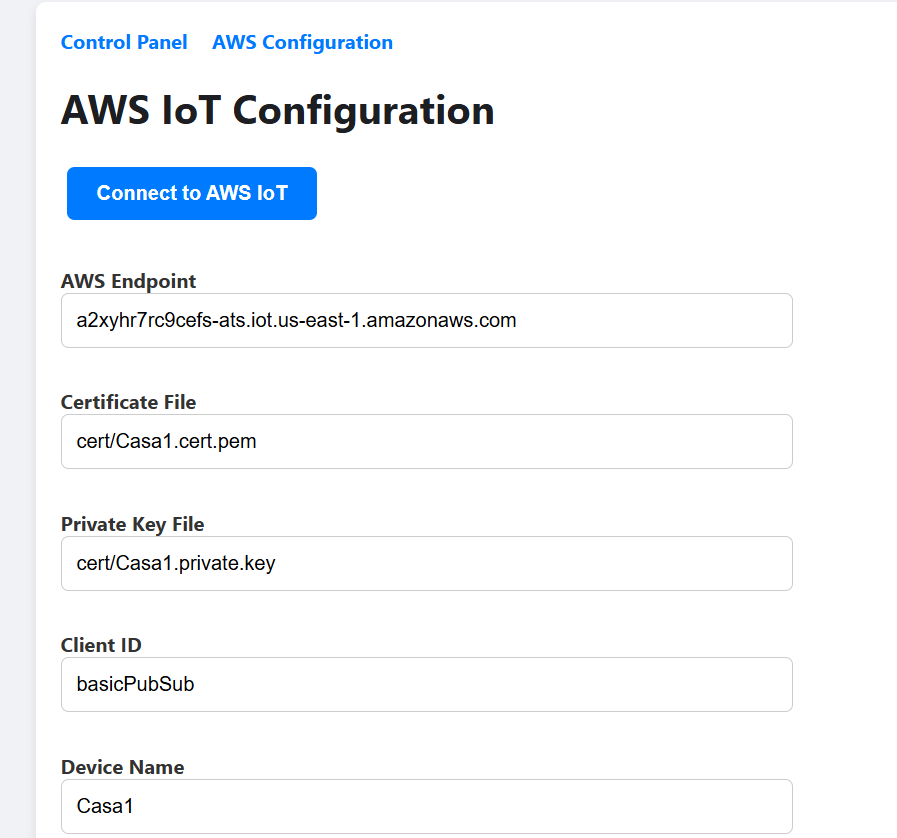
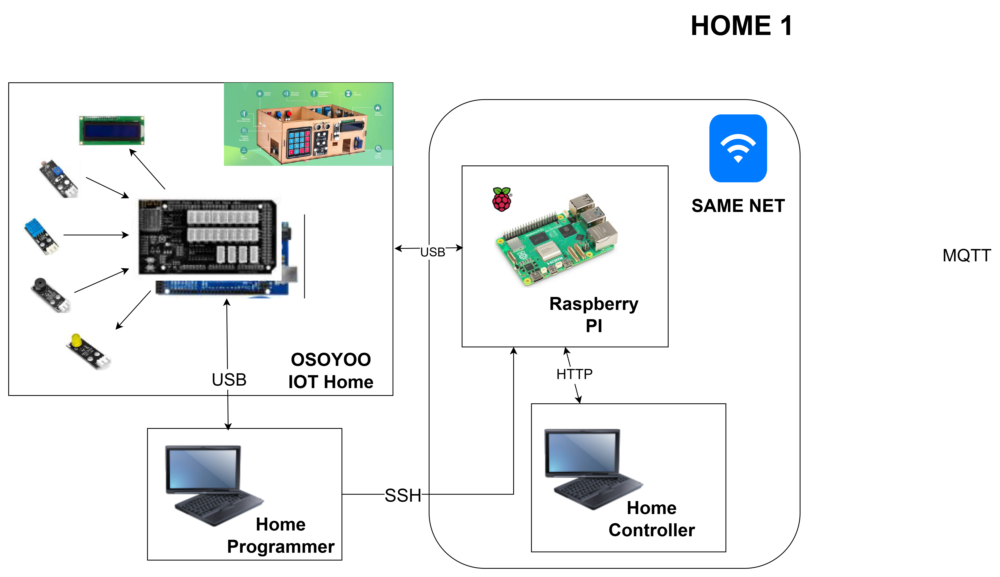

# 🏠 SmartHome IoT con Raspberry 
### Control de vivienda mediante APP WEB y conexión a USB a Arduino


Proyecto de automatización de una vivienda basado en Arduino, que permite controlar distintos dispositivos mediante comunicación por puerto serie.

---

## 📌 Descripción

La Raspberry PI nos proporciona:

- Conexión LAN/WIFI al exterior
- Conexión USB con el Arduinoo
- Entorno de ejecución Linux compatible con Python, Node, Java, C++. Lo que queramos!!!. 

Por lo tanto vamos a montar un SW completo (UI-RESTAPI) en esta placa Raspberry hecho en Python (Flask) con la siguiente funcionalidad:

- Conectarnos con la casa mediante USB (Puerto serie) para poder comunicarnos con el SW Slave.
- Mostrar el estado de la casa y poder actuar mediante un UI WEB.
- Conectarnos con AWS IOTCore para mandar mensajes de telemetría y recibir comandos de acción remota a la casa.

---

## 📁 Estructura del proyecto

```
📦 master
 ┣ 📂 templates (Templates HTML de UI)
 ┃ ┗ 📜 index.html (Landing Page)
 ┃ ┗ 📜 aws_config.html (UI de configuración y conexión con AWS)
 ┃ ┗ 📜 base.html (Elementos comunes)
 ┣ 📂 cert (Carpeta donde dejaremos los certificados de conexión a AWS IOTCore)
 ┗ 📜 app.py (Endpoints REST API)
 ┗ 📜 README.md
```
---

## ⚙️ Requisitos

Antes de empezar, necesitas:

- 🧰 Cualquier IDE de desarrollo para Python y HTML/CSS/JS
- 🔗 Cable USB conectado a Arduino 
- 📚 Librerías necesarias python:
  - awsiotsdk
  - Flask
  - pyserial

---

## 🚀 Instalación en Raspberry PI

Vamos a pasar los ficheros de SW mediante SCP a la PaspberryPI y ejecutar utilizando python.

### 1. Conexión SSH con la Raspberry PI

- Tenemos que conectar las Raspberry en la misma red (WAN o LAN) con el PC donde bajamos el repositorio de código
- Puede ser que necesitemos enganchar una pantalla y teclado para poder configurar la red de la Respberry y obtener la IP local de ese dispositivo
- Ejecutar el comando SSH e introducir el password correspondiente:
  ```
  ssh user_name@ip_raspberry
  POR EJEMPLO
  ssh iot@192.168.1.23
  ```
- Con esto comprobamos que tenemos conectividad con la Raspberry PI

---

### 2. Pasar los ficheros de SW a la Respberry PI

- El SW dentro del repositorio está en la carpeta master.
- Utilizar el comando SCP para pasar los fichero a una carpeta dentro de la Raspberry

  ```
  scp -r ruta_ficheros_origen user_name@ip_raspberry:directorio_destino
  POR EJEMPLO
  scp -r . iot@192.168.1.23:/homt/iot/master
  ```

### 3. Instalar librerías python necesarias

En las Raspberry (conectandonos por SHH):

```
pip install awsiotsdk
pip install Flask
pip install pyserial
```
---

### 4. Conectar por cable USB al Arduino

- Conecta el Arduino a la Raspberry mediante el cable USB. Da igual en que puerto USB conectarlo. 

---

### 5. Ejecutar Programa Python

En las Raspberry (conectandonos por SHH), en el directorio donde descargamos el SW:

```
python app.py
```
Poder dejarlo como servicio en el arranque de la raspberry, y asi no nos tenemos que preocupar de arrancarlo siempre que reiniciamos,

Puede ser que no esté instalado python en la Raspberry, para ello es sencillo, actualizamos el gestor APT y luego instalamos python3 y pip, para resolver las dependencias:

```
sudo apt update
sudo apt upgrade -y
sudo apt install python3 -y
sudo apt install python3-pip -y
```
---

### 6. Comprobar

Al haber cargado el programa desde nuestro PC podremos acceder mediante nuestro navegador web favorito a  http://ip_raspberry:5000

Para control Local:



Para configurarar conexión salida Cloud.



---

## 🔌 Arquitectura del sistema



---

## 🧠 Funcionalidades

✔ Control de acción sobre elementos de la casa (LED, RGB, Buzzer, LCD, Motor)  
✔ Lectura de los sensores de la casa (Temperatura, Humedad, Presencía, Fuego)
✔ Configuración/Conexión AWS IOTCore como si fuera un THING, mediante MQTT

---

## ⚠️ Notas importantes

- Hay que hacer un trabajo de configuración de la Raspberry, sobre todo si viene de gráfica
- El SW es una aplicación WEB en Python+Flusk  
- Permite un control local de la casa
- Para comunicación con AWS IOTCore hay que cargar los certificados de conexión, las instrucciones están en el README de cloud.

---

## 👨‍💻 Recomendación

💡 Se recomienda revisar el código fuente para entender completamente el funcionamiento del sistema y poder ampliarlo.


---

## 🙌 Autor

Miguel Goyena basado en el proyecto [GITHUB de Ander Frago para E4M](https://github.com/anderfrago/smarthome-lessons) 
